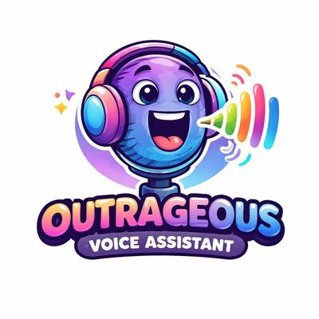

# Ollama Voice Assistant



An **open-source voice assistant** with a simple FastAPI backend and a simple HTML front-end. ASR and TTS run fully local with open-weight models; the **LLM ("the brain") runs on Ollama Cloud** via its OpenAI-compatible API. This is a fork of [acatovic/ova](https://github.com/acatovic/ova) that swaps the local Ollama LLM for Ollama Cloud — so you get a smarter, faster model without needing a GPU big enough to hold it.

Models used:

* ASR: [NVIDIA parakeet-tdt-0.6b-v3 600M](https://huggingface.co/nvidia/parakeet-tdt-0.6b-v3) (local)
* LLM: [deepseek-v4-flash:0731](https://ollama.com/library/deepseek-v4-flash) via Ollama Cloud (fast + intelligent; swap in `ova/pipeline.py` for any other cloud model)
* TTS: [Kyutai Pocket TTS](https://huggingface.co/kyutai/pocket-tts) - a lightweight CPU-friendly TTS with built-in voice cloning (local)

**Why "Outrageous"?** Because it was outrageously easy to create!

How it works:

1. Frontend captures user's audio and sends a blob of bytes to the backend `/chat` endpoint
2. Backend parses the bytes, extracts sample rate (SR) and channels, then:
   1. Transcribes the audio to text using an automatic speech recognition (ASR) model
   2. Sends the transcribed text to the LLM on **Ollama Cloud**, i.e. "the brain"
   3. Sends the LLM response to a text-to-speech (TTS) model
   4. Performs normalization of TTS output, converts it to bytes, and sends the bytes back to frontend
3. The frontend plays the response audio back to the user

All voices - the default one and the cloned ones - are handled by a single TTS model: Kyutai's Pocket TTS. It runs faster than real-time on a plain CPU, so the same code path is used on both the CUDA and Apple Silicon (MLX) backends.

Voice cloning requires no finetuning and no transcript: a profile is just a 3-30 second `ref_audio.wav` clip plus a `prompt.txt` with instructions for the LLM. During install (`./ova.sh install`), a one-off setup step encodes each profile's reference clip into a voice state (`profiles/<profile>/voice.safetensors`) and runs a short warmup dialogue (saved under `.ova/` so you can audition each voice). Subsequent starts simply load the cached `.safetensors`, which is much faster than re-encoding the audio. The default profile has no reference clip and uses Pocket TTS's built-in "alba" voice - a nice female voice.

> **Note on voice cloning:** encoding your own `ref_audio.wav` requires access to the gated [kyutai/pocket-tts](https://huggingface.co/kyutai/pocket-tts) weights - accept the terms on the model page and log in locally with `uvx hf auth login`. Without it, the built-in voices (e.g. the default profile) still work, and the install step will simply skip the cloned profiles with a warning.


## TO-DO

- [x] Add Apple Silicon (MLX) support
- [x] Remove the need for prepared transcript for voice cloning (Pocket TTS clones directly from the audio clip)
- [ ] Add Voice Activity Detection (VAD) client-side (e.g. see  https://docs.vad.ricky0123.com/)
- [ ] Add orchestration to detect more complex tasks (e.g. requiring GPT/Claude) or whether tool calls (web search, file search, other cli/API calls are needed)


## Demos

## Voice assistant with Dua Lipa's cloned voice
https://github.com/user-attachments/assets/9b546ab1-8c71-44f2-85d8-433b3a3d267f

## Voice assistant with the default voice
https://github.com/user-attachments/assets/a296dbf7-9fa9-4904-bf22-d0cdc1e625a4

## Pre-requisites

- Python >=3.12
- `uv` installed and available in PATH
- An **Ollama Cloud** API key (set `OLLAMA_API_KEY`; get one at https://ollama.com)
- Verified on a system with RTX 5070 (12GiB VRAM); lower-end setups should be possible

## Install

Fetch Python deps and HF models (the LLM is not downloaded — it lives on Ollama Cloud):

```bash
# NVIDIA/CUDA
OLLAMA_API_KEY=your_key ./ova.sh install --cuda

# Apple/MLX
OLLAMA_API_KEY=your_key ./ova.sh install --mlx
```

The last install step downloads the Pocket TTS weights, builds the voice state (`voice.safetensors`) for every profile, and generates a short warmup dialogue per voice under `.ova/` - have a listen! To clone the bundled `dua`/`sydney` voices you need access to the gated [kyutai/pocket-tts](https://huggingface.co/kyutai/pocket-tts) weights (see the note above); the default voice works without it.

## Start

Start the front-end and back-end services (non-blocking) with a fast default voice assistant:

```bash
OLLAMA_API_KEY=your_key ./ova.sh start
```

To start the voice assistant with one of the pre-cloned voices:

```bash
OVA_PROFILE=dua OLLAMA_API_KEY=your_key ./ova.sh start  # NOTE: with cloned voice of a famous artist
```

- Front-end: http://localhost:8000
- Back-end: http://localhost:5173

Logs and PIDs are stored under `.ova/`. If you want to follow the logs in another terminal window:

```bash
tail -f .ova/backend.log
```

## Configuration

| Env var | Default | Purpose |
|---|---|---|
| `OLLAMA_API_KEY` | *(required)* | Ollama Cloud API key |
| `OLLAMA_HOST` | `https://ollama.com/v1` | OpenAI-compatible base URL. Set to `http://localhost:11434` to fall back to a local Ollama server. |
| `OVA_PROFILE` | `default` | Voice profile to use |

To change the LLM, edit `DEFAULT_CHAT_MODEL` in `ova/pipeline.py` (any model available on Ollama Cloud works, e.g. `glm-5.2`, `kimi-k3`, `nemotron-3-nano:30b`).

## Stop

Stop all services:

```bash
./ova.sh stop
```

## Adding new voices (clones / profiles)

In order to add a new voice, no code changes are required. You simply need to do the following:

1. Create a new directory `profiles/<voice>/`
2. Add a 3-30 second voice clip `ref_audio.wav` and any instructions in the `prompt.txt` - both under the sub-directory created in the previous step. No transcript needed!
3. To start the service with the new voice, simply run `OVA_PROFILE=<voice> ./ova.sh start`

On first start the reference clip is encoded and cached as `profiles/<voice>/voice.safetensors`; subsequent starts load the cached voice state directly. You can also pre-build the voice state (and get a warmup clip to audition under `.ova/`) with:

```bash
uv run --no-sync python3 -m ova.tts <voice>
```

And that's it!

**Enjoy!**

---

**Disclaimer & Ethical Considerations:** This project is a proof-of-concept demonstration and is provided **as is** without any warranties or guarantees. It is intended for educational and experimental purposes only. The voice cloning is also purely for educational purposes - for real-life/commercial use, one should always seek the relevant permissions. This demo also highlights the ethical and security aspects - the ease with which one can clone a voice with no finetuning, using only a 3-5 second audio clip - which is both eerie, and potentially dangerous in the wrong hands. All this can be accomplished on a commodity PC that most people can afford.
